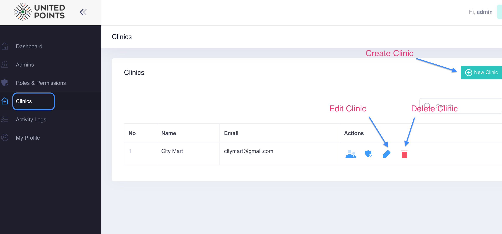
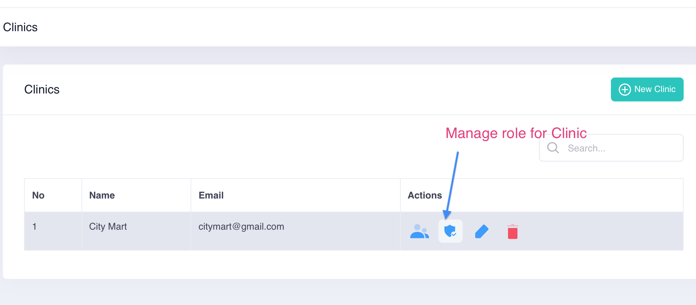
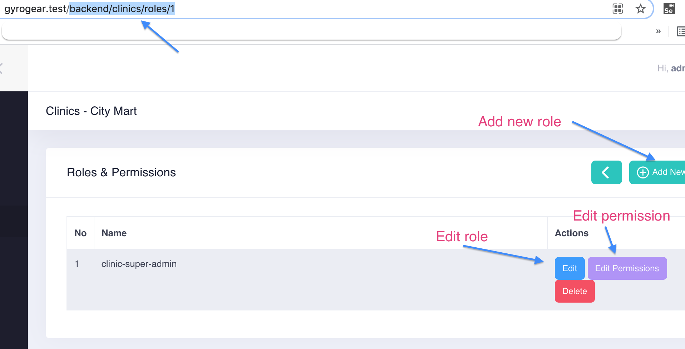
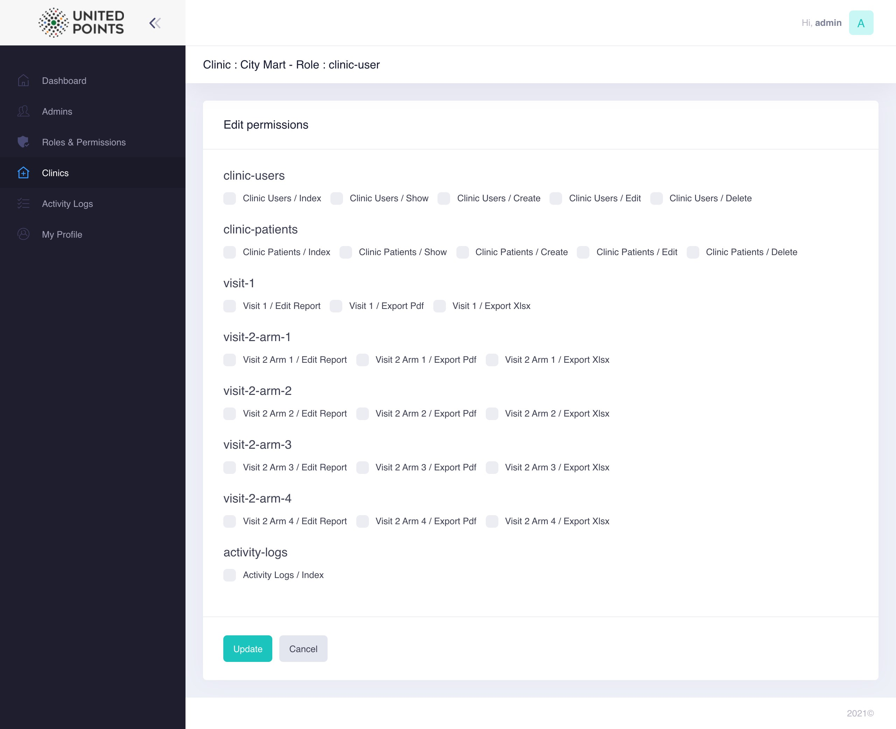

# Clinic

* [Clinic](clinic.md#clinic)
* [Clinic Roles](clinic.md#roles)
* [Clinic Permissions](clinic.md#permissions)

## Clinic

A new Clinic can be created, edited and deleted as below screenshot.

## Roles

Clinic has its' own **roles and permissions** scenario like admin. 

> Note : By default, roles and permissions for Clinic is not showing. Must go to a route like 
>
> > `/backend/clinics/roles/1`
>
>  or click on manage role and permissions icon as the 2nd screenshot above.

## Permissions

Each role of clinic has several permissions such as users, patients and visits. By default, no checkbox is checked and it will show all the sidebar menus in [Clinic Dashboard ](../clinic-dashboard/). 

