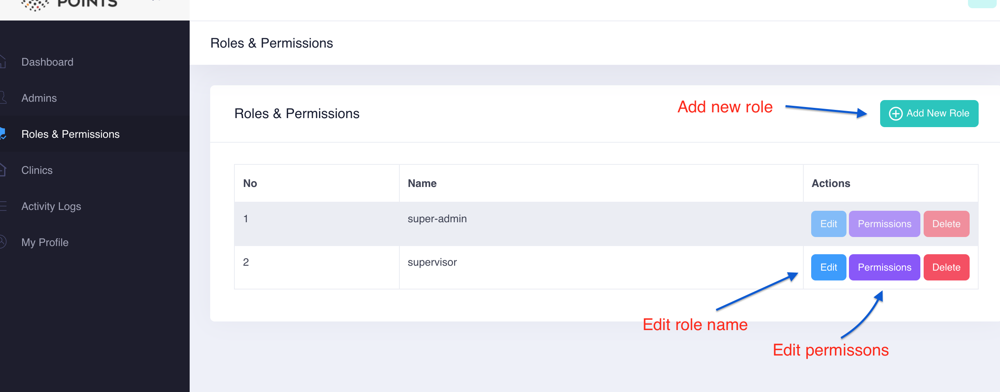
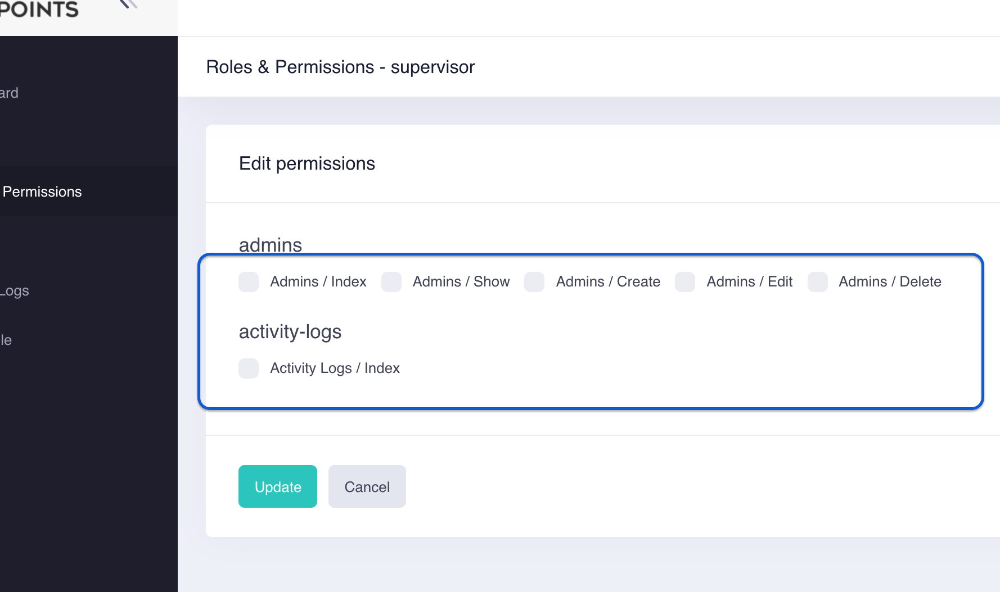

# Roles and Permissions

Admin can click on `roles and permissions` and manage a specific role as below screenshot.

Initially each role has 5 permissions

If no permission is checked as the below screenshot, it will show all the sidebar menus by default. Admin will able to manage all admin users, clinics and see the activity logs. But if one permission is checked, it will only available for the one was checked. 

\( For instance, if admin check on only `activity-logs` checkbox, there will be only `Activity Logs` menu in the sidebar. \)

