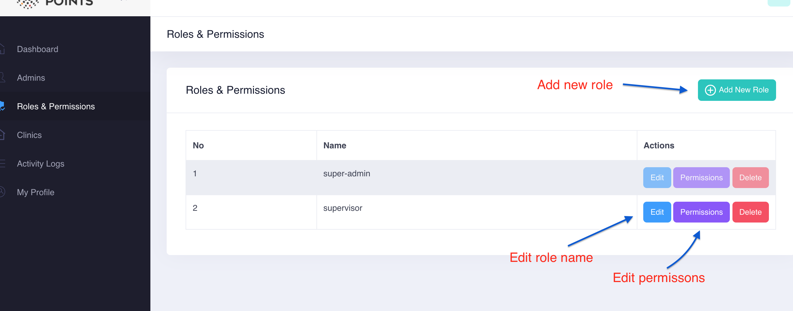

# Admin User

* [Admin User](user.md#admin-user)
* [Admin Roles](user.md#roles)
* [Admin Permissions](user.md#permissions)

## Admin User

A new `admin user` who will manage the **Admin Dashboard** can be created under **Admins** section as below. 

To assign `admin` to a specific role, you can click on the **edit admin profile** icon.

## Roles

Admin can click on `roles and permissions` and manage a specific role as below screenshot.

> This roles and permission are only related to Admin user.

> For Clinic role and permission, [please check here](clinic.md)

## Permissions

Initially each role has 5 permissions

If no permission is checked as the below screenshot, it will show all the sidebar menus by default. Admin will able to manage all admin users, clinics and see the activity logs. But if one permission is checked, it will only show up for the one was checked. 

\( For instance, if admin check on only `activity-logs` checkbox, there will be only `Activity Logs` menu in the sidebar. \)

