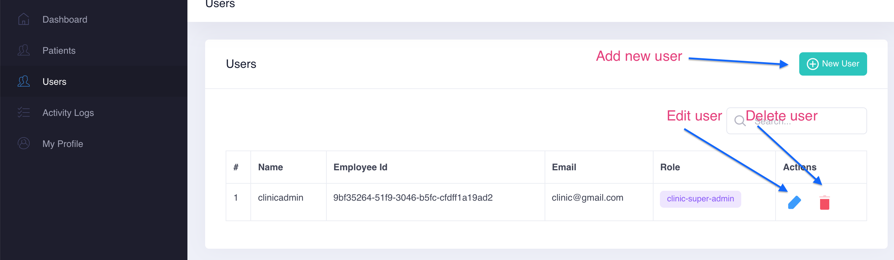

# Users

A new **User** who will manage the **Clinic Dashboard** can be created under **Users** section as below. 

Each Clinic can have several users and each user's **roles and permissions** can be managed in [Admin Dashboard](../admin-dashboard/) 

> Roles and Permissions are only available in Admin Dashboard

