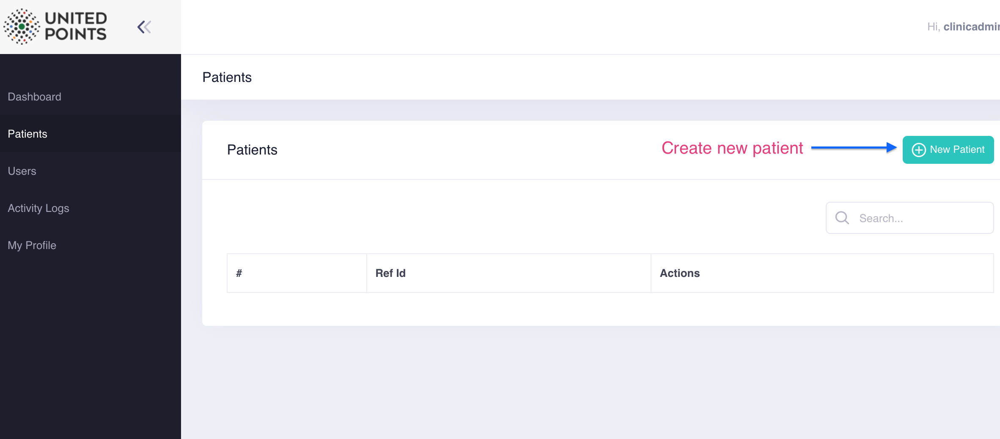
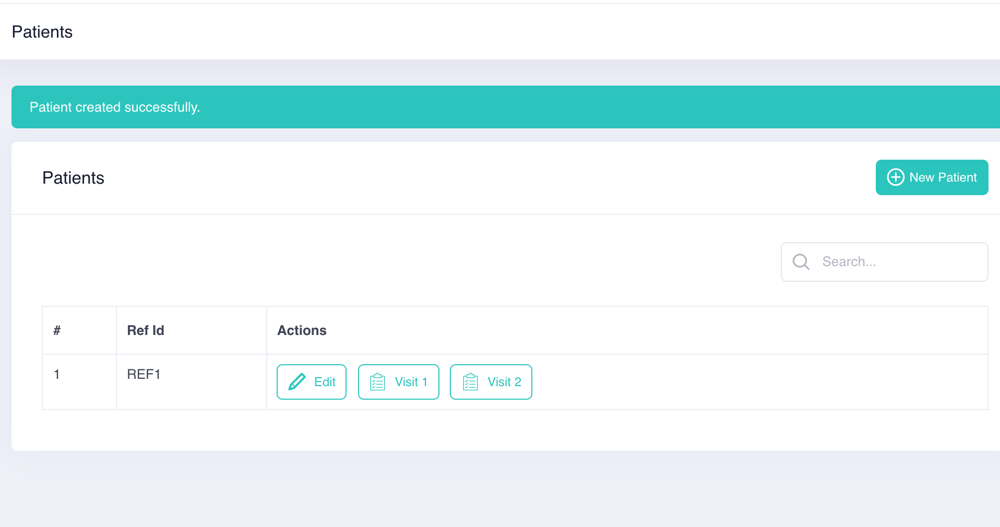

# Patients

A new Patient ID can be created under **patients** section.

After a **patient reference ID** is created, the sys will generate two visits as below.

Each visit has multiple questions for case report of a patient.

For more about **Visits ,** [please check out in Visits](roles-and-permissions.md)

