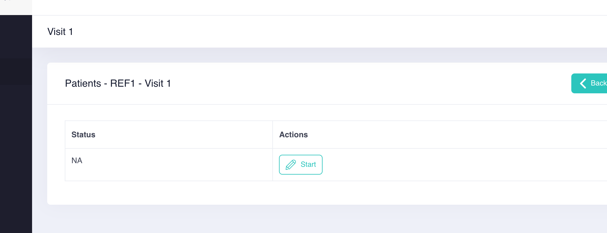
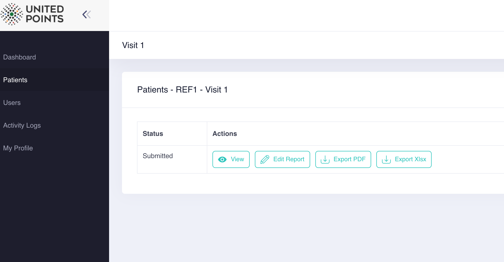
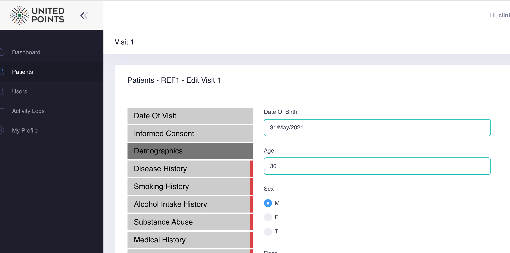

# Visits

There are two visits for each patient

* visit 1
* visit 2

Each visit has these options

* View report
* Start Report/Continue Report, Edit report
* Export pdf
* Export xlsx 

Primarily, it will only show `start` report.

When all the visit questions are filled in the form, it will show the rest such as 

_view report, edit report, export pdf and export xlsx._ 

## Visit 1

There is only one form in **Visit 1**. 

## Visit 2

There are four type of forms in **Visit 2**

* Arm 1 - With No Device
* Arm 2 - With Placobe Glove
* Arm 3 - With Low RPM Glove
* Arm 4 - With Gyroglove

